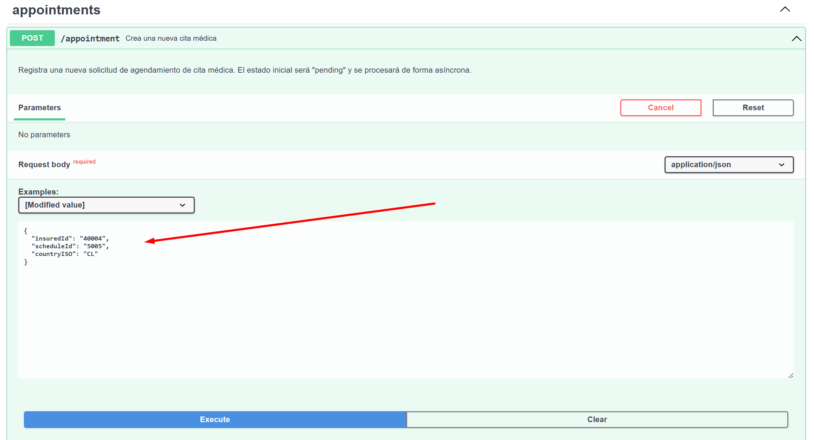
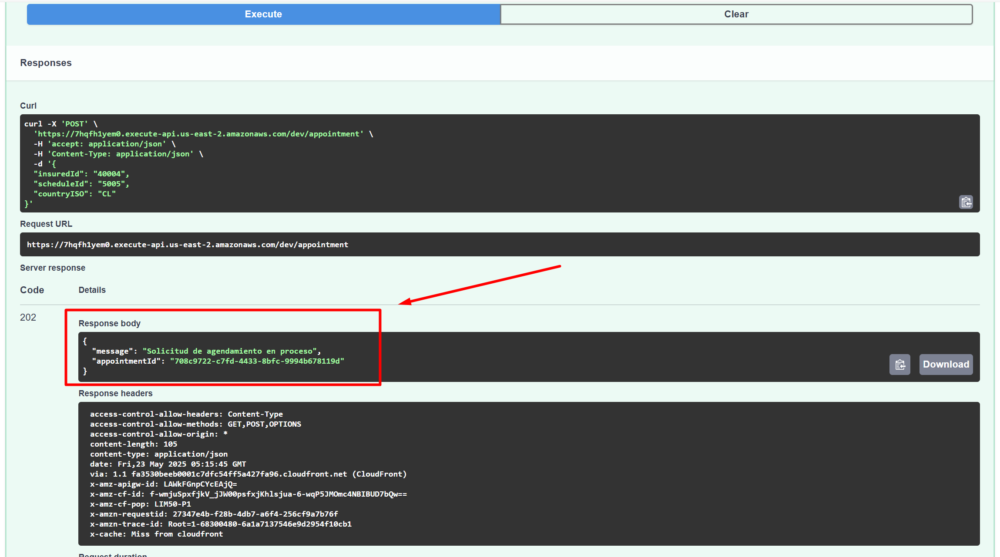
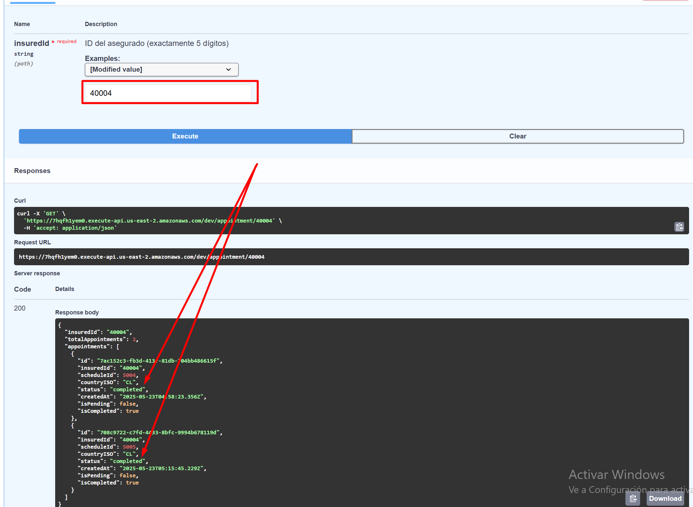
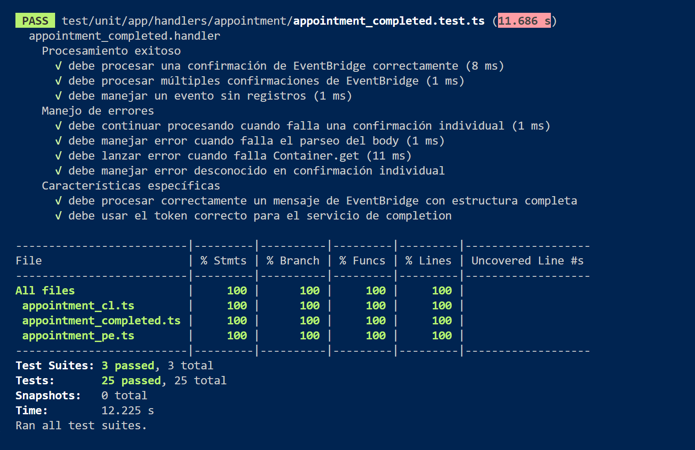

# Proyecto de Gestión de Citas Médicas - RIMAC API Serverless

## Descripción General

API serverless desarrollada para RIMAC Seguros, implementando una arquitectura hexagonal y Domain-Driven Design (DDD) para la gestión de citas médicas multi-país (Perú y Chile). El sistema utiliza CQRS para separar operaciones de lectura y escritura, aprovechando servicios AWS como Lambda, DynamoDB, SNS, SQS y EventBridge.

## 🚀 Despliegue en Producción

### Endpoints Desplegados (Ambiente DEV)

- **Base URL**: `https://7hqfh1yem0.execute-api.us-east-2.amazonaws.com/dev`
- **Swagger Documentation**: [https://7hqfh1yem0.execute-api.us-east-2.amazonaws.com/dev/docs](https://7hqfh1yem0.execute-api.us-east-2.amazonaws.com/dev/docs) ⭐ **[INTERFAZ DE PRUEBAS]**

### Endpoints Disponibles

| Método | Endpoint | URL Completa | Descripción |
|--------|----------|--------------|-------------|
| POST | `/appointment` | `https://7hqfh1yem0.execute-api.us-east-2.amazonaws.com/dev/appointment` | Crear nueva cita médica |
| GET | `/appointment/{insuredId}` | `https://7hqfh1yem0.execute-api.us-east-2.amazonaws.com/dev/appointment/{insuredId}` | Consultar citas por ID de asegurado |
| GET | `/docs` | `https://7hqfh1yem0.execute-api.us-east-2.amazonaws.com/dev/docs` | **📚 Documentación Swagger UI - USAR PARA PRUEBAS** |

### 🧪 Para Realizar Pruebas

**Usar la interfaz Swagger UI para probar los endpoints:**
### ➡️ [https://7hqfh1yem0.execute-api.us-east-2.amazonaws.com/dev/docs](https://7hqfh1yem0.execute-api.us-east-2.amazonaws.com/dev/docs)

La interfaz Swagger permite:
- ✅ Probar los endpoints directamente desde el navegador
- ✅ Ver ejemplos de request y response
- ✅ Explorar los modelos de datos
- ✅ Ejecutar pruebas con diferentes parámetros

## Arquitectura

### Arquitectura Hexagonal y DDD

El proyecto sigue una arquitectura hexagonal con los siguientes componentes:

1. **UI/API [Adaptadores Primarios]**
   - Controladores HTTP y handlers Lambda
   - Gestión de solicitudes entrantes

2. **Capa de Aplicación [Puerto Primario]**
   - Servicios de aplicación y orquestación
   - Implementación de comandos y queries (CQRS)

3. **Casos de Uso [Controladores de Lógica de Negocio]**
   - Command Handlers y Query Handlers
   - Validaciones y reglas de negocio específicas

4. **Capa de Dominio [Núcleo]**
   - Entidades y objetos de valor
   - Eventos de dominio
   - Interfaces de repositorios y servicios

5. **Puertos Secundarios [Interfaces de Dominio]**
   - Contratos para servicios externos
   - Interfaces de adaptadores

6. **Capa de Infraestructura [Adaptadores Secundarios]**
   - Implementaciones de repositorios (DynamoDB)
   - Adaptadores para servicios AWS (SNS, SQS, EventBridge)
   - Procesadores por país

7. **Recursos Compartidos [Shared Kernel]**
   - Interfaces CQRS base
   - Utilidades comunes

## Flujo de Procesamiento

### Creación de Cita
1. Cliente envía solicitud POST a `/appointment`
2. Handler valida y crea comando `CreateAppointmentCommand`
3. CommandHandler procesa y guarda en DynamoDB
4. Publica evento en SNS según el país (PE/CL)
5. SQS recibe mensaje filtrado por país
6. Procesador específico del país ejecuta lógica de negocio
7. Publica evento de completado en EventBridge
8. Handler de completado actualiza estado final

### Consulta de Citas
1. Cliente solicita GET `/appointment/{insuredId}`
2. Query Handler recupera datos de DynamoDB
3. Retorna lista de citas del asegurado

## Mapeo del Diagrama vs Implementación

### ✅ **Paso 1**: API Gateway → Lambda (appointment) → DynamoDB
* **Implementado**: `appointmentHandler` con endpoints POST y GET
* **DynamoDB**: `AppointmentsTable` para guardar con estado "pending"

### ✅ **Paso 2**: Lambda (appointment) → SNS
* **Implementado**: El handler tiene acceso a los ARNs de los tópicos SNS
* **SNS Topics**: `PeruAppointmentTopic` y `ChileAppointmentTopic`

### ✅ **Paso 3**: SNS → SQS (por país)
* **SQS_PE**: `PeruAppointmentQueue` con suscripción al topic de Perú
* **SQS_CL**: `ChileAppointmentQueue` con suscripción al topic de Chile
* **FilterPolicy**: Configurado para filtrar por `countryISO`

### ✅ **Paso 4**: SQS → Lambda país → RDS MySQL
* **appointment_pe**: `appointmentPeruHandler` → `mysql_pe`
* **appointment_cl**: `appointmentChileHandler` → `mysql_cl`
* **VPC**: Ambos handlers configurados con VPC para acceso a RDS

### ✅ **Paso 5**: Lambda país → EventBridge
* **EventBridge**: `AppointmentEventBus` configurado
* Los handlers de país tienen permisos para publicar eventos

### ✅ **Paso 6**: EventBridge → SQS → Lambda → DynamoDB
* **EventBridge Rule**: `AppointmentCompletedRule` para eventos "appointment.completed"
* **SQS**: `AppointmentCompletedQueue` recibe eventos del EventBridge
* **Lambda**: `appointmentCompletedHandler` actualiza estado a "completed" en DynamoDB

### 🎯 Verificación completa:
Todos los componentes del diagrama están presentes:
* ✅ API Gateway
* ✅ Lambda principal (appointment)
* ✅ DynamoDB
* ✅ SNS
* ✅ SQS por país (sqs_pe, sqs_cl)
* ✅ Lambdas por país (appointment_pe, appointment_cl)
* ✅ RDS MySQL por país (mysql_pe, mysql_cl)
* ✅ EventBridge
* ✅ SQS para confirmaciones
* ✅ Lambda para actualizar estado

## Tecnologías Utilizadas

- **Runtime**: Node.js 18.x
- **Framework**: Serverless Framework 3.32.1
- **Lenguaje**: TypeScript
- **Base de Datos**: 
  - DynamoDB (almacenamiento de citas)
  - MySQL/RDS (datos específicos por país)
- **Mensajería**: 
  - SNS (publicación de eventos)
  - SQS (procesamiento asíncrono)
  - EventBridge (eventos de dominio)
- **Testing**: Jest
- **Herramientas**: Webpack, TypeDI, Reflect-metadata

## Prerrequisitos

### Herramientas Requeridas

- **AWS CLI**: Configurado con credenciales válidas
- **Node.js**: Versión 18.x
- **Serverless Framework**: `npm install -g serverless@3.32.1`
- **TypeScript**: Para desarrollo local
- **MySQL Client**: Para conexión a RDS

### Configuración AWS

1. **Configurar AWS CLI**:
   ```bash
   aws configure
   # Ingresar Access Key ID, Secret Access Key, región (us-east-2)
   ```

2. **Crear recursos en AWS**:
   - VPC con subnets privadas
   - Security Groups para Lambda y RDS
   - RDS MySQL (uno para Perú, otro para Chile)
   - Roles IAM con permisos necesarios

## Instalación y Configuración

### Clonar el Repositorio
```bash
git clone https://github.com/sistemas0011ff/reto-rimac.git
cd reto-rimac
```

### Instalar Dependencias
```bash
npm install
```

### Variables de Entorno

Crear archivo `.env` en la raíz del proyecto:

```env
# Base de datos Perú
PE_DB_HOST=dbreto-rimac.chg6ac68oakf.us-east-2.rds.amazonaws.com
PE_DB_USER=admin
PE_DB_PASSWORD=Inicios20222022$$$
PE_DB_NAME=medical_appointments_pe
PE_DB_PORT=3306

# Base de datos Chile
CL_DB_HOST=dbreto-rimac.chg6ac68oakf.us-east-2.rds.amazonaws.com
CL_DB_USER=admin
CL_DB_PASSWORD=Inicios20222022$$$
CL_DB_NAME=medical_appointments_cl
CL_DB_PORT=3306

# APIs externas
SWAPI_BASE_URL=http://swapi.py4e.com/api
EARTH_API_BASE_URL=https://api.le-systeme-solaire.net/rest

# AWS Local
LOCAL_AWS_REGION=us-east-2
```

### Inicialización de Base de Datos
Para el reto se tiene acceso a BD mysql en rds.
Ejecutar el siguiente comando para crear las tablas en MySQL para ambos países:

```bash
node scripts/initDatabase.js
```

**Salida esperada:**
```
🚀 Iniciando inicialización de bases de datos...
📊 Procesando base de datos de Perú...
✅ Conectado a la base de datos de Perú
✅ Tabla 'appointments' creada/verificada en Perú
✅ Tabla verificada en Perú
🔐 Conexión cerrada para Perú
📊 Procesando base de datos de Chile...
✅ Conectado a la base de datos de Chile
✅ Tabla 'appointments' creada/verificada en Chile
✅ Tabla verificada en Chile
🔐 Conexión cerrada para Chile
🎉 Inicialización de bases de datos completada
```

**Script de inicialización (`scripts/initDatabase.js`):**

El script crea automáticamente las tablas `appointments` en ambas bases de datos (Perú y Chile) con la siguiente estructura:

- **Campos principales:**
  - `id`: UUID de la cita
  - `insured_id`: ID del asegurado
  - `schedule_id`: ID del horario médico
  - `country_iso`: Código del país (PE/CL)
  - `status`: Estado de la cita (pending, completed, cancelled, processing)
  - `created_at`: Fecha de creación
  - `updated_at`: Fecha de última actualización
  - `processed_at`: Fecha de procesamiento

- **Índices para optimización:**
  - `idx_insured_id`: Para búsquedas por asegurado
  - `idx_schedule_id`: Para búsquedas por horario
  - `idx_status`: Para filtrar por estado
  - `idx_created_at`: Para ordenamiento temporal
  - `idx_country_iso`: Para filtrar por país

- **Restricciones:**
  - Check constraint para validar que `country_iso` sea correcto para cada BD
  - Check constraint para validar estados permitidos

## Ejecución

### Desarrollo Local
```bash
# Iniciar en modo offline con todos los servicios locales
npm run start

# Este comando ejecuta:
# 1. Compilación TypeScript
# 2. Validación de AWS
# 3. Validación de base de datos
# 4. Inicialización de DynamoDB local
# 5. Serverless offline
```

### Despliegue en AWS

**Prerrequisito**: Tener AWS CLI configurado con las credenciales apropiadas (`aws configure`)

```bash
# Desplegar
serverless deploy --stage dev

```

### Evidencia de Despliegue

Comando ejecutado:
```bash
Fyapeuser@DESKTOP-J1V3S4J MINGW64 /d/retos/reto-servlees-swapi
$ serverless deploy --stage dev
```

Resultado:
```bash
✔ Service deployed to stack mas-v001-dev (77s)
endpoints:
  POST - https://7hqfh1yem0.execute-api.us-east-2.amazonaws.com/dev/appointment
  GET - https://7hqfh1yem0.execute-api.us-east-2.amazonaws.com/dev/appointment/{insuredId}
  GET - https://7hqfh1yem0.execute-api.us-east-2.amazonaws.com/dev/docs
functions:
  appointmentHandler: mas-v001-dev-appointmentHandler (20 MB)
  getAppointmentsByInsuredHandler: mas-v001-dev-getAppointmentsByInsuredHandler (20 MB)
  appointmentPeruHandler: mas-v001-dev-appointmentPeruHandler (20 MB)
  appointmentChileHandler: mas-v001-dev-appointmentChileHandler (20 MB)
  appointmentCompletedHandler: mas-v001-dev-appointmentCompletedHandler (20 MB)
  swaggerUIHandler: mas-v001-dev-swaggerUIHandler (20 MB)
```

## Documentación de la API

### Información General

- **Título**: Medical Appointments API
- **Versión**: 1.0.0
- **Descripción**: API para gestionar citas médicas - Sistema de agendamiento para asegurados
- **URL Base**: `https://7hqfh1yem0.execute-api.us-east-2.amazonaws.com/dev`
- **Documentación Swagger**: [https://7hqfh1yem0.execute-api.us-east-2.amazonaws.com/dev/docs](https://7hqfh1yem0.execute-api.us-east-2.amazonaws.com/dev/docs)

### Endpoints, Ejemplos en Sagger





#### 1. Crear Cita Médica

Registra una nueva solicitud de agendamiento de cita médica. El estado inicial será "pending" y se procesará de forma asíncrona.

- **URL**: `/appointment`
- **Método**: `POST`
- **Tags**: `appointments`

**Request Body**

Content-Type: `application/json`

```json
{
  "insuredId": "string",    // ID del asegurado (exactamente 5 dígitos)
  "scheduleId": "string",   // ID del horario médico (número positivo)
  "countryISO": "string"    // Código ISO del país (PE o CL)
}
```

**Campos Requeridos**
- `insuredId` (string, pattern: `^\d{5}$`) - ID del asegurado (exactamente 5 dígitos)
- `scheduleId` (string) - ID del horario médico (número positivo)
- `countryISO` (string, enum: ['PE', 'CL']) - Código ISO del país

**Ejemplos de Request**

Ejemplo para Perú:
```json
{
  "insuredId": "12345",
  "scheduleId": "1001",
  "countryISO": "PE"
}
```

Ejemplo para Chile:
```json
{
  "insuredId": "30001",
  "scheduleId": "2001",
  "countryISO": "CL"
}
```

**Respuestas**

202 - Accepted
```json
{
  "message": "Solicitud de agendamiento en proceso",
  "appointmentId": "123e4567-e89b-12d3-a456-426614174000"
}
```

400 - Bad Request
```json
{
  "message": "string",
  "error": "string"
}
```

500 - Internal Server Error

#### 2. Obtener Citas por Asegurado

Consulta todas las citas médicas de un asegurado específico, incluyendo su estado actual (pending, completed, cancelled).

- **URL**: `/appointment/{insuredId}`
- **Método**: `GET`
- **Tags**: `appointments`

**Parámetros**

| Nombre | Ubicación | Tipo | Requerido | Descripción |
|--------|-----------|------|-----------|-------------|
| insuredId | path | string | Sí | ID del asegurado (exactamente 5 dígitos) |

Pattern: `^\d{5}$`

**Ejemplos de Parámetros**
- Asegurado de Perú: `12345`
- Asegurado de Chile: `30001`

**Respuestas**

200 - OK

Lista de citas médicas del asegurado

```json
{
  "insuredId": "string",
  "totalAppointments": "integer",
  "appointments": [
    {
      "id": "string (uuid)",
      "insuredId": "string",
      "scheduleId": "string",
      "countryISO": "string",
      "status": "string",
      "createdAt": "string (date-time)"
    }
  ]
}
```

Ejemplo con citas:
```json
{
  "insuredId": "12345",
  "totalAppointments": 2,
  "appointments": [
    {
      "id": "123e4567-e89b-12d3-a456-426614174000",
      "insuredId": "12345",
      "scheduleId": "1001",
      "countryISO": "PE",
      "status": "completed",
      "createdAt": "2025-05-22T07:00:00.000Z"
    },
    {
      "id": "456e7890-e89b-12d3-a456-426614174001",
      "insuredId": "12345",
      "scheduleId": "1002",
      "countryISO": "PE",
      "status": "pending",
      "createdAt": "2025-05-22T08:00:00.000Z"
    }
  ]
}
```

Ejemplo sin citas:
```json
{
  "insuredId": "99999",
  "totalAppointments": 0,
  "appointments": []
}
```

400 - Bad Request
```json
{
  "message": "El ID del asegurado debe tener exactamente 5 dígitos",
  "error": "INVALID_INSURED_ID_FORMAT",
  "insuredId": "string"
}
```

500 - Internal Server Error

### Modelos de Datos

#### CreateAppointmentRequest
```typescript
{
  insuredId: string;   // Pattern: ^\d{5}$ - Exactamente 5 dígitos
  scheduleId: string;  // Número positivo
  countryISO: string;  // Enum: ['PE', 'CL']
}
```

#### Appointment
```typescript
{
  id: string;          // Formato UUID
  insuredId: string;   // ID del asegurado
  scheduleId: string;  // ID del horario médico
  countryISO: string;  // Enum: ['PE', 'CL']
  status: string;      // Enum: ['pending', 'completed', 'cancelled']
  createdAt: string;   // Formato date-time ISO 8601
}
```

#### AppointmentListResponse
```typescript
{
  insuredId: string;           // ID del asegurado consultado
  totalAppointments: integer;  // Total de citas encontradas
  appointments: Appointment[]; // Lista de citas del asegurado
}
```

### Estados de Cita

| Estado | Descripción |
|--------|-------------|
| `pending` | Cita pendiente de procesamiento |
| `completed` | Cita procesada exitosamente |
| `cancelled` | Cita cancelada |

### Códigos de País Soportados

| Código | País |
|--------|------|
| `PE` | Perú |
| `CL` | Chile |

### Ejemplos de Uso

#### CURL - Crear Cita
```bash
curl -X POST https://7hqfh1yem0.execute-api.us-east-2.amazonaws.com/dev/appointment \
  -H "Content-Type: application/json" \
  -d '{
    "insuredId": "12345",
    "scheduleId": "1001",
    "countryISO": "PE"
  }'
```

#### CURL - Consultar Citas
```bash
curl -X GET https://7hqfh1yem0.execute-api.us-east-2.amazonaws.com/dev/appointment/12345
```

## Arquitectura de Mensajería

### SNS Topics
- `appointment-pe-topic-v001-dev`: Citas de Perú
- `appointment-cl-topic-v001-dev`: Citas de Chile

### SQS Queues
- `appointment-pe-queue-v001-dev`: Procesamiento Perú
- `appointment-cl-queue-v001-dev`: Procesamiento Chile
- `appointment-completed-queue-v001-dev`: Confirmaciones

### EventBridge
- `appointment-event-bus-v001-dev`: Bus de eventos de dominio
- Eventos publicados:
  - `appointment.created`
  - `appointment.processing`
  - `appointment.completed`
  - `appointment.failed`

## Seguridad y VPC

### Configuración VPC
- **VPC ID**: vpc-0a6ba2de9cce21d1c
- **Security Group**: sg-0017dcb23a1cf69cd
- **Subnets**:
  - subnet-021fd4e501e8e96b3
  - subnet-0ac4fae8eec3f5a18
  - subnet-04529b39833629024

### IAM Permissions
El rol de Lambda incluye permisos para:
- DynamoDB (CRUD operations)
- SNS (Publish)
- SQS (Send, Receive, Delete)
- EventBridge (PutEvents)
- VPC (Network interfaces)
- X-Ray (Tracing)

## Testing

### Ejecutar Tests
```bash
# Todos los tests
npm test

# Tests con cobertura
npm run test:coverage

# Tests en modo watch
npm run test:watch
```

### Cobertura de Tests
- Handlers de API
- Servicios de dominio
- Casos de uso (Commands y Queries)
- Adaptadores de infraestructura

### Tests Ejecutados
- `appointment_cl.test.ts`: Procesamiento de citas Chile
- `appointment_completed.test.ts`: Confirmación de citas
- `appointment_pe.test.ts`: Procesamiento de citas Perú



## Monitoreo y Observabilidad

### AWS X-Ray
- Tracing habilitado para Lambda y API Gateway
- Permite rastrear el flujo completo de las solicitudes

### CloudWatch Logs
- Logs estructurados por función Lambda
- Métricas personalizadas para:
  - Tiempos de procesamiento
  - Tasas de error
  - Citas por país

## Estructura del Proyecto

```
reto-servlees-swapi/
├── src/
│   ├── app/
│   │   ├── di/                    # Contenedor de inyección de dependencias
│   │   └── handlers/              # Lambda handlers
│   │       ├── appointment/       # Handlers de citas
│   │       └── swaggerUIHandler.ts
│   └── contexts/
│       ├── appointment/
│       │   ├── application/       # Capa de aplicación (CQRS)
│       │   │   ├── commands/
│       │   │   ├── dtos/
│       │   │   ├── interfaces/
│       │   │   ├── queries/
│       │   │   └── services/
│       │   ├── domain/            # Lógica de negocio
│       │   │   ├── entities/
│       │   │   ├── events/
│       │   │   ├── interfaces/
│       │   │   ├── ports/
│       │   │   ├── services/
│       │   │   ├── types/
│       │   │   └── value-objects/
│       │   └── infrastructure/    # Implementaciones
│       │       ├── adapters/
│       │       ├── processors/
│       │       ├── repositories/
│       │       └── services/
│       └── shared/                # Código compartido
│           └── cqrs/              # Interfaces CQRS
├── test/                          # Tests unitarios
├── scripts/                       # Scripts de utilidad
├── serverless.yml                 # Configuración Serverless
├── tsconfig.json                  # Configuración TypeScript
├── jest.config.ts                 # Configuración Jest
└── webpack.config.js              # Configuración Webpack
```

## Consideraciones de Producción

1. **Escalabilidad**:
   - DynamoDB en modo PAY_PER_REQUEST
   - Lambda con concurrencia reservada si es necesario
   - SQS con Dead Letter Queues

2. **Seguridad**:
   - Conexiones RDS mediante VPC privada
   - Secrets Manager para credenciales sensibles
   - API Gateway con autorización

3. **Resiliencia**:
   - Reintentos configurados en SQS
   - Circuit breakers en servicios externos
   - Timeouts apropiados por función

## Troubleshooting

### Problemas Comunes

1. **Error de conexión a RDS**:
   - Verificar Security Groups
   - Confirmar que Lambda está en la VPC correcta

2. **Mensajes no procesados en SQS**:
   - Revisar filter policies en SNS
   - Verificar permisos IAM

3. **Eventos no llegan a EventBridge**:
   - Confirmar VPC Endpoint configurado
   - Verificar formato de eventos

## Notas Importantes

1. **Procesamiento Asíncrono**: Las citas se procesan de forma asíncrona. El endpoint de creación retorna inmediatamente con estado 202 (Accepted).

2. **Validación de ID**: El ID del asegurado debe tener exactamente 5 dígitos numéricos.

3. **Filtrado por País**: El sistema procesa las citas según el país especificado (PE o CL) utilizando diferentes reglas de negocio.

4. **Estado Inicial**: Todas las citas nuevas inician con estado `pending`.


## Autor

**Arturo Eduardo Fajardo Gutiérrez** - Desarrollador Senior

